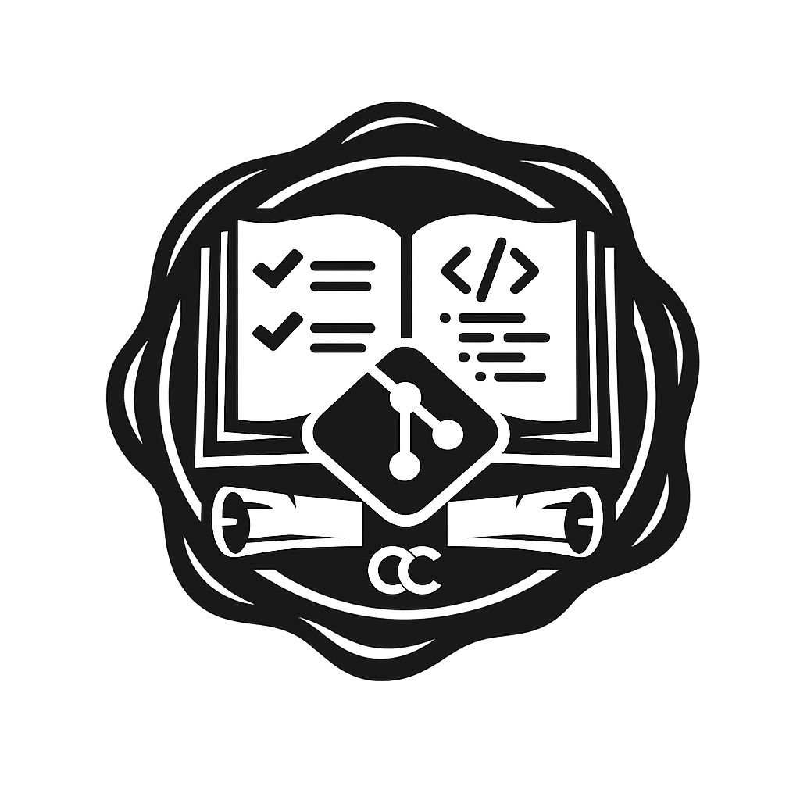

# Codex Commitorum

**The book of small changes.**

A codex of software engineering principles and workflows for disciplined coding agents.

This repository provides a compact baseline for contract-first development:

- **Doctrine** in `doctrine.md`
- **Protocol** in `AGENTS.md`
- **Praxis** in `.agents/skills/`



## Core ideas

- interfaces define contracts
- tests verify that implementations satisfy those contracts
- behavior changes usually start with a failing test
- refactoring follows real design pressure
- commits are atomic and explain why

## What's included

### Doctrine

`doctrine.md` contains the stable engineering principles.

### Protocol

`AGENTS.md` contains the always-on repository workflow for agents.

### Praxis

`.agents/skills/` contains trigger-based workflows:

- `contract-first-change`
- `tdd-workflow`
- `refactor-triage`
- `commit-policy`

## Repository structure

```text
.
├── AGENTS.md
├── doctrine.md
└── .agents/skills/
    ├── contract-first-change/SKILL.md
    ├── tdd-workflow/SKILL.md
    ├── refactor-triage/SKILL.md
    └── commit-policy/SKILL.md
```

## Workflow defaults

For behavior changes, bug fixes, and interface changes:

1. identify the contract
2. add or update the narrowest meaningful failing test
3. show the test early when practical
4. implement the minimum passing change
5. refactor only when friction is real
6. keep commit boundaries clean and rationale-focused

## Commit message template

```text
<title>

Prior to this change, <problem or missing behavior>.

This change <how the patch addresses it>.
```

## Non-goals

This is not a rigid process framework or a substitute for engineering judgment. It is a practical baseline that improves reviewability and consistency.

## Contributing

Prefer small, coherent changes that improve clarity, practical use, and separation between doctrine, AGENTS, and skills.

## License

CC0-1.0
